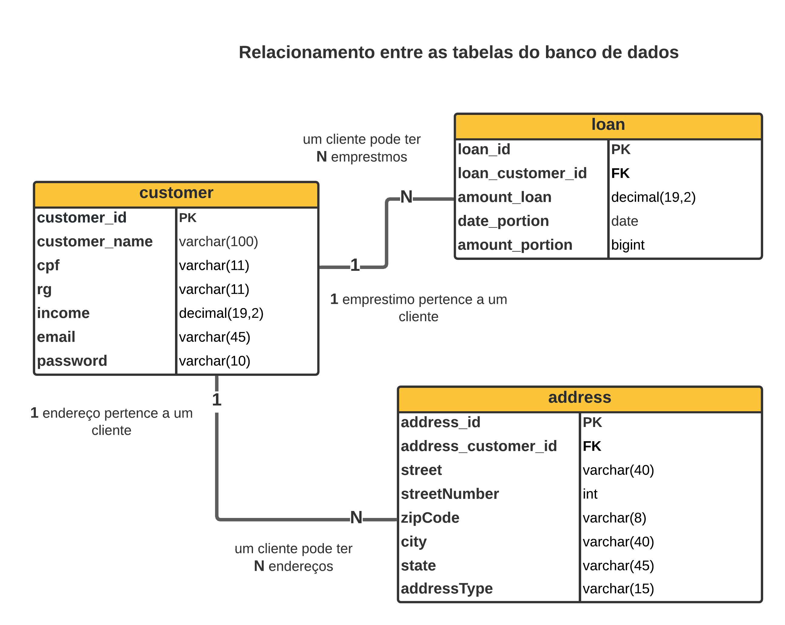

# TQI Evolution Backend

## Funcionalidades Solicitadas no desafio.
- [X] Cadastro de clientes -
O cliente pode cadastrar: nome, e-mail, CPF, RG, endereço completo, renda e senha.
    

- [X] Solicitação de empréstimo -
Para solicitar um empréstimo, precisamos do valor do empréstimo, data da primeira parcela e quantidade de parcelas.
O máximo de parcelas será 60 e a data da primeira parcela deve ser no máximo 3 meses após o dia atual.
    

- [X] Acompanhamento das solicitações de empréstimo -
O cliente pode visualizar a lista de empréstimos solicitados por ele mesmo e também os detalhes de um de seus empréstimos.
Na listagem, devemos retornar no mínimo o código do empréstimo, o valor e a quantidade de parcelas.
No detalhe do empréstimo, devemos retornar: código do empréstimo, valor, quantidade de parcelas, data da primeira parcela, 
e-mail do cliente e renda do cliente.
  

- [ ] Login - a autenticação deverá ser realizada por e-mail e senha.

Para resolver o desafio proposto foi construído uma API Rest utilizando a linguagem de programação java,
banco de dados relacional MYSQL em um container docker que é executado pelo docker compose, a seguir será detalhado 
como o banco de dados foi estruturado e o porque das escolhas.
  

###Relacionamento OneToMany
Como cliente pode ter varios empréstimo e mais de um endereço como por exemplo do trabalho por isso 
a escolha por esse relacionemento entre as tabelas.
  

###Regras de Negocios
Foi observado que as informações abaixo representam caracteristicas proprias de um negocio, por isso foi adicionado 
a validação destes dados antes de salvar no banco de dados.
 - O máximo de parcelas são 60.
 - Data da primeira parcela deve ser no máximo 3 meses após o dia atual.

###Arquitetura da api
A API foi implementada utilizando a arquitetura monolítica, onde tem-se um acoplamento maior dos componentes
o que pode ocasionar em um efeito colateral em cascata como por exemplo a API toda pode ficar sem receber e processar 
requisições, porque teve um erro que gerou outros erros em cascata. Foi a arquitetura escolhida para solucionar o desafio por ser mais simples e porque é a que tenho mais 
conhecimento.
  

###Recursos Disponíveis

| Metodo                     |     | recurso                                                                                           |     |
|----------------------------|-----|--------------------------------------------------------------------------------------------------------|-----|
| post                       |     | /customer - cadastro de cliente                                                                   |     |
| post                       |     | /address/{customerId} -  cadastra o endereço de um cliente que já tenha cadastro.                 |     |
| post                       |     | /loan/{customerId} - cadastra a solicitação do emprestimo de um cliente que já tenha cadastro.    |     |
| get                        |     | /loan/{cpf} -- Lista de Emprestimos solicitados pelo cliente.                                     |     |
| get                        |     | /loan//detail/{cpf}  - Lista de detalhes dos emprestimos.                                         |     |
